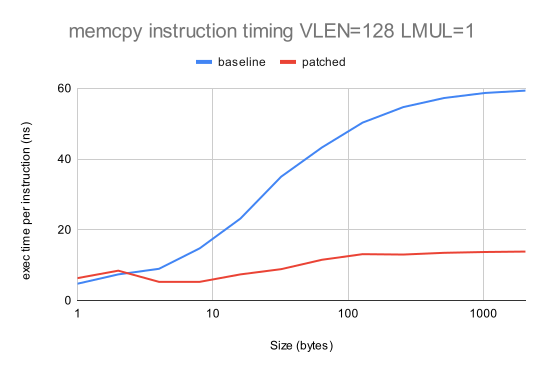
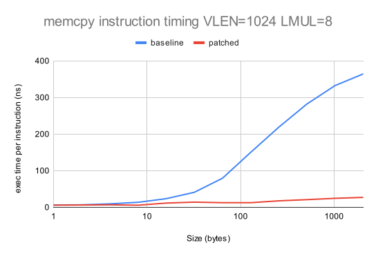
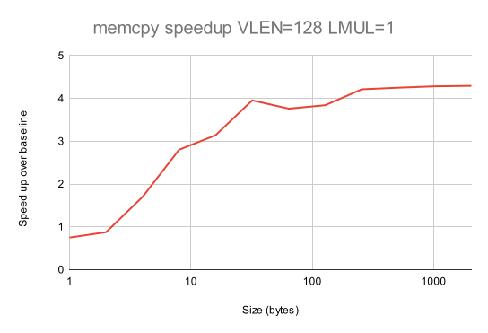
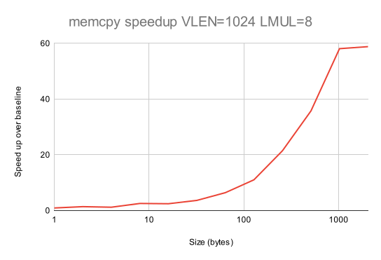
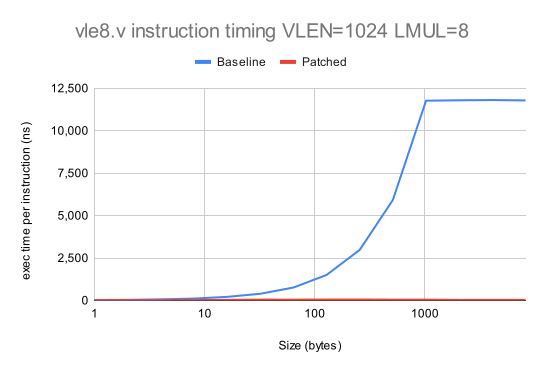

# RISE RP005 QEMU weekly report 2024-07-17

## Overview

We applied a patch in the combined patches that fixed most of the SPECCPU failures.
The performance gain over the baseline with Our patches combined with Max's achieve a x60 speed-up for memcpy, an average 12% speed-up for the run of SPEC CPU over the baseline. One SPECCPU benchmark achieves a speed-up of 35%.
Our patches are now going to be submitted as RFC.

## The project team
- Paolo Savini (Embecosm)
- Hélène Chelin (Embecosm)
- Jeremy Bennett (Embecosm)
- Hugh O'Keeffe (Ashling)
- Nadim Shehayed (Ashling)
- Daniel Barboza (Ventana)

## Work completed since last report

- WP2
  - Explore optimizations of the calls to vsetvl/vsetvli.
    - In progress.
    - We aim at avoiding the generation of a function call for every vsetvl/vsetvli in the host code.
  - Analyze SPECCPU:
    - instrument SPECCPU to get and estimate of the most used vector load/store sizes.
      - will be extensible to the analysis of other instructions.
    - analyze the variability of SPECCPU scores.
      - the 4 benchmarks where Max's patches and ours give a different instruction count.
    - analyze the remaining failures.
      - In progress.
  - Verify that the use __builtin_memcpy triggers vector instructions.
    - In progress.
    - AVX instructions are generated (128 bit).
    - We are not getting AVX2 instructions, possibly due compiler tuning.

- Submission of the patches.
- Submitted a talk to the RISC-V Summit.

## Work planned for the coming two weeks

- WP2
  - Emulate vsetvl/vsetvli without calls in the host code.

  - Analyze SPECCPU:
    - instrument SPECCPU to get and estimate of the most used vector load/store sizes.
      - will be extensible to the analysis of other instructions.
    - analyze the variability of SPECCPU scores.
      - the 4 benchmarks where Max's patches and ours give a different instruction count.

  - Verify that the use __builtin_memcpy triggers vector instructions.
    - In progress.
    - investigate the GCC tuning needed to enable AVX2 instructions to be materialized.
    - attempt the direct use of AVX2 instructions and measure the performance.

- WP3
  - Measure performance on ARM.

## Current priorities

Our current set of agreed priorities are as follows

- vector load/store ops for x86_64 AVX
- vector load/store ops for AArch64/Neon
- vector integer ALU ops for x86_64 AVX
- vector load/store ops for Intel AVX10

For each of these there will be an analysis phase and an optimization phase, leading to the following set of work packages.
- WP0: Infrastructure
- WP1: Analysis of vector load/store ops on x86_64 AVX
- WP2: Optimization of vector load/store ops on x86_64 AVX
- WP3: Analysis of vector load/store ops on AArch64/Neon
- WP4: Optimization of vector load/store ops on AArch64/Neon
- WP5: Analysis of integer ALU ops on x86_64 AVX
- WP6: Optimization of integer ALU ops on x86_64 AVX
- WP7: Analysis of vector load/store ops on Intel AVX10
- WP8: Optimization of vector load/store ops on Intel AVX10

These priorities can be revised by agreement with RISE during the project.

# Detailed description of work

## WP2

### Combined patches

We fixed a bug in the HC patches on top of Max's and managed to run the failing SPECCPU tests. There's still one failure to debug but we obtained the expected performance gain on:

- small data sizes: equal or less than 8 bytes per iteration.
- small vectors with no grouping: VLEN=128, LMUL=1.
- large data sizes: more than 8 bytes per iteration.

These optimizations combined with Max's patches achieved up to x60 speed-up with the memcpy benchmarks and an average 12% speed-up with SPECCPU 2017.
See details below.

### __builtin_memcpy analysis

The use of __builtin_memcpy results in the introduction of host native vector instructions. The vector instructions that are generated depend on the compiler flags used to build QEMU.

Here are code snippets introduced by __builtin_memcpy for data transfers larged than 64 bytes with different GCC flags to build QEMU:

- default (no flags)
```
movdqu (%rax),%xmm2
mov    %edx,%ebx
movups %xmm2,(%r9)
movdqu 0x10(%rax),%xmm3
movups %xmm3,0x10(%r9)
```
These are SSE2 instructions that move 16 bytes of data and operate on 16 bytes long registers (xmm*).

-mno-sse -mno-sse2

The QEMU build fails. SSE/SSE2 instructions are core extensions for the machine used.

-mno-avx

```
movdqu (%rax),%xmm2
mov    %edx,%ebx
movups %xmm2,(%r9)
movdqu 0x10(%rax),%xmm3
movups %xmm3,0x10(%r9)
```
The SSE2 extension kicks in.

-mavx
```
vmovdqu (%r9),%xmm0
mov    %edx,%ebx
vmovdqu %xmm0,(%rax)
vmovdqu 0x10(%r9),%xmm1
vmovdqu %xmm1,0x10(%rax)
```
These are AVX extensions that still operate on 16 bytes chunks of data and 16 bytes registers. Same effect as the SSE2 instructions for the performance.

-mavx2
```
vmovdqu (%r9),%xmm0
mov    %edx,%ebx
vmovdqu %xmm0,(%rax)
vmovdqu 0x10(%r9),%xmm1
vmovdqu %xmm1,0x10(%rax)
```
We still get the AVX extension instructions and registers here. This could be due to some GCC tuning needed that influences how __builtin_memcpy is built.
There are cases in which splitting a 256 bit register into two 128 registers and calling twice a 128 bits load or store instead of a sinlge 256 bits load or store can be beneficial. We need to verify that for QEMU.

Next tasks:

- investigate the GCC tuning needed to enable AVX2 instructions to be materialized.
- attempt the direct intriduction of AVX2 instructions through GCC intrinsics (for measurement purposes).

# Statistics

## `memcpy` performance of combined patches + __builtin_memcpy

This is our standard benchmark, which we evaluate for: i) small vectors with `LMUL=1`; and ii) large vectors with `LMUL=8`.  We show the speed-up over the baseline performance with no patch applied.  The full data are in [this Google spreadsheet](https://docs.google.com/spreadsheets/d/1lGPp2tmAPhzFwJfUZtmbyYUaszHwvK1UqVovC4j_Wl4/edit?usp=sharing) and summarized in the following graph.

:

:

:

:


## Individual RVV instruction performance x86

Here is the the performance of `vle8.v`/`vse8.v` for each patch.  The full data are in [this Google spreadsheet](https://docs.google.com/spreadsheets/d/1VYwDk230Qe5DsO_rVOYwhNtQSMsLKSdI0a_XLAVsh5A/edit?usp=sharing) and summarized in the following graph.

:

:

:

:


## SPEC CPU 2017 performance

All benchmarks are compiled using the GCC 14.1 tool chain with rv64gcv as the architecture.  We use the speed benchmarks, which are run using the test datasets.

### SPEC CPU 2017 and combined patches

#### Check again this info:

Looking at the 11 benchmarks which gave consistent SPEC CPU results we observe the following.

- Max's patches improve performance of 6 benchmarks and reduce performance of 5 benchmarks compared to baseline.  Some of these are significant both in improving (`628.pop2_s` 21.8% better) and reducing performance (`648.exchange2_s` 21.8% worse).

- Adding `__builtin_memcpy` on top of Max's patches improves performance of 7 benchmarks and reduces performance of 4 benchmarks compared to baseline.

- Adding `__builtin_memcpy` on top of Max's patches reduces peformance compared to Max's patches for 5 benchmarks.

From this we have a number of questions to resolve

1. Why do some benchmarks (even in baseline) not yield an instruction count?
2. Why do some benchmarks produce a different SPEC CPU instruction count, even though we are only changing QEMU?
3. Why does `_builtin_memcpy` slow down some benchmarks.

Future work will include:
- making multiple runs, to identify benchmarks subject to natural variation
- where the problem is not natural variation, understand why we get different instruction counts for the same benchmark with different versions of QEMU.
- instrumenting QEMU to track the size of typical vector loads and stores.


# Actions

2024-07-03
- **Jeremy** **Paolo** **Helene** to share SSH keys with Nathan so that they can have access to a BananaPi board with RVV 1.0.
  - In progress.

2024-06-05
- **Paolo** Check behaviour of QEMU with tail bytes.
  - Deferred to prioritize host targeted optimization work.

2024-05-15

- **Jeremy** to look at impact of masked v unmasked and strided v unstrided on vector operations.
  - lower proirity.

2024-05-08

- **Jeremy** to characterise QEMU floating point performance and file it as a performance regression issue in QEMU GitLab.
  - low priority, deferred to prioritize the smoke tests work.

2024-05-01

- **Daniel** to advise **Paolo** on best practice for preparing QEMU upstream submissions.


# Risk register

The risk register is held in a shared [spreadsheet](https://docs.google.com/spreadsheets/d/1mHNwGGGPJ-ls0pgCbvkSdGDoKW4vftzYWeIPPYZYfjY/edit?usp=sharing), which is updated continuously.

There are no changes to the risk register this week.

# Planned absences

Helene will be on vacation from the 29th of July to the 11th of August
